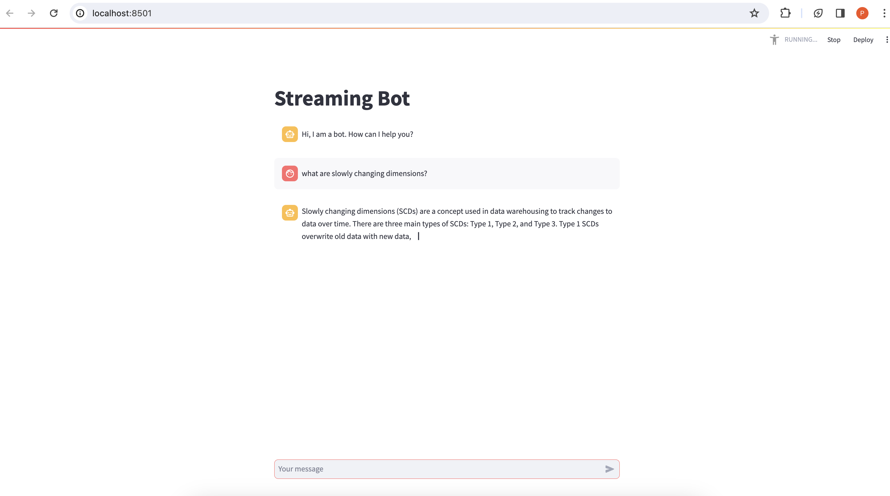
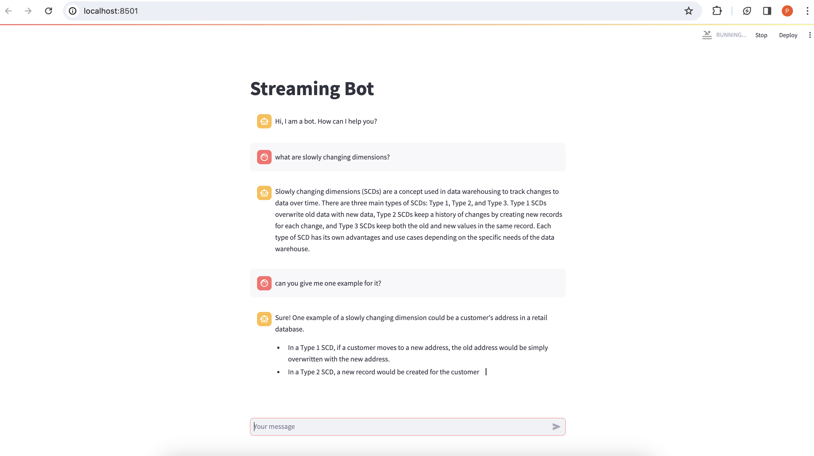
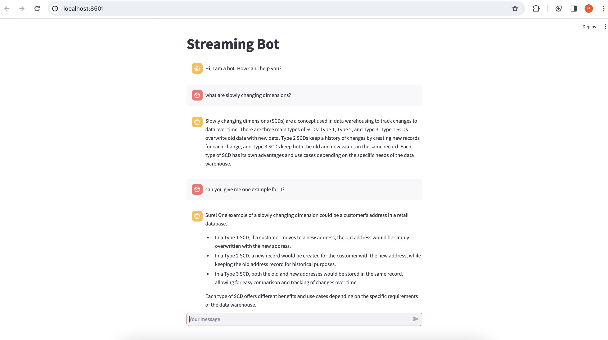

# Streaming Chatbot

The app is a chatbot that will remember the previous messages and respond to the user's input. The response from the chatbot will be streamed as it is being generated.

## Usage

Update your OpenAI API key in the .env file:

```
OPENAI_API_KEY=<your open ai key>
```

To run the app, you will need to have Python installed on your machine. You can install the required packages by running the following command in your terminal:

```
pip install -r requirements.txt
```

Once you have installed the required packages, you can run the app by running the following command in your terminal:

```
streamlit run src/app.py
```

This will start the Streamlit app, and you will be able to interact with the chatbot in your web browser.


## Screenshots

Streaming answer for the query:




Streaming answer for the following query:




Complete conversation:

